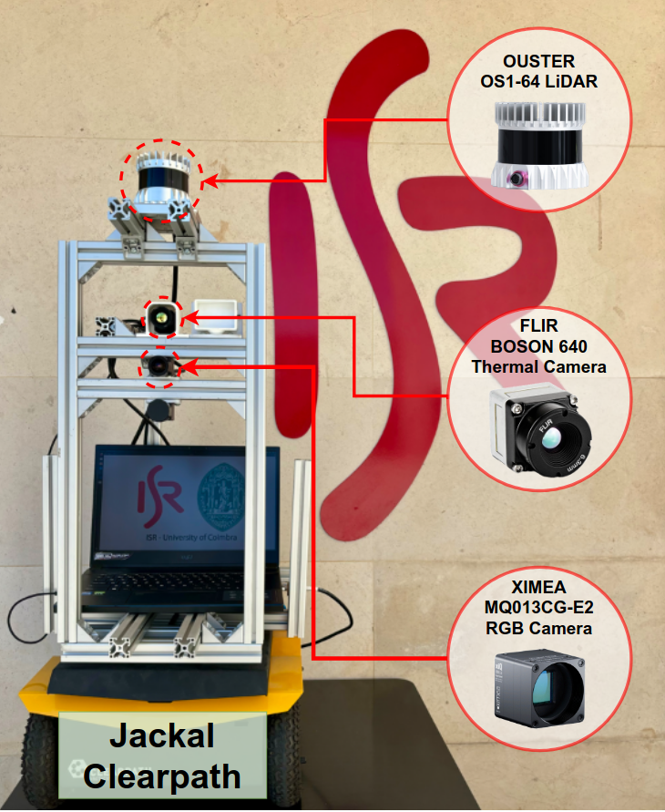
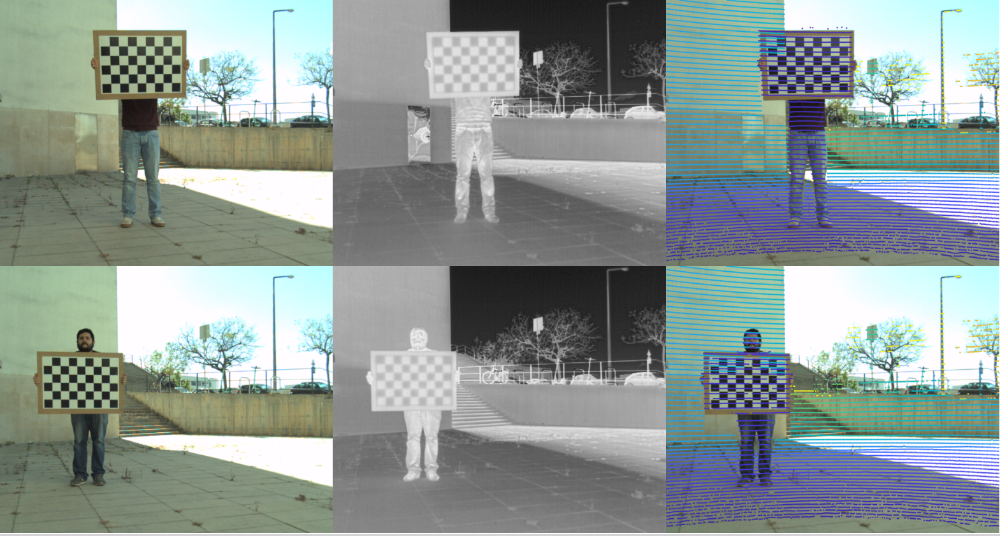
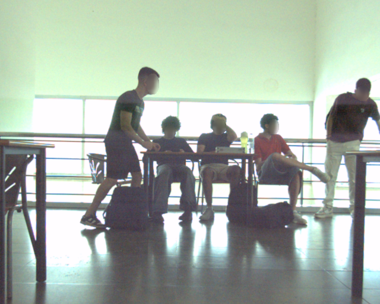
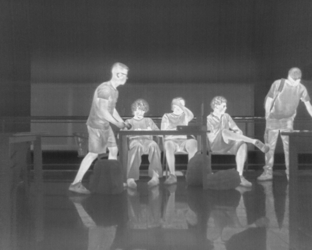

# MID-3K (Multimodal ISR Dataset with 3000 images)

[https://github.com/kennedyk1/MID-3K](https://github.com/kennedyk1/MID-3K)


This dataset, collected by the [ISR (Institute of Systems and Robotics)](https://www.isr.uc.pt/) Team, is a new multi-sensory dataset that was organized, calibrated, curated, and annotated. The sensory data was collected using ROS and a Jackal Clearpath mobile robot (see Fig. 1), operating in two indoor environments: three floors of the [DEEC](https://www.uc.pt/fctuc/deec/) building and two floors of [DEI](https://www.uc.pt/fctuc/dei/) building at the [University of Coimbra](https://www.uc.pt/), Polo 2, Portugal.

This main repository contains information and links to the sub-repositories that store the different modalities of the MID-3K dataset. Each sub-repository is categorized according to modality:

- [MID-3K RGB Modality](https://github.com/kennedyk1/MID-3K-rgb): Contains RGB images.
- [MID-3K Thermal Modality](https://github.com/kennedyk1/MID-3K-thermal): Contains thermal images.
- [MID-3K Depth Modality](https://github.com/kennedyk1/MID-3K-depth): Contains depth data captured by LiDAR.
- [MID-3K Intensity Modality](https://github.com/kennedyk1/MID-3K-intensity): Contains intensity data captured by LiDAR.

You can clone any of these modalities to your local environment using the `git clone` command. Simply open the terminal and follow these steps:

   ```bash
   git clone https://github.com/kennedyk1/MID-3K-rgb
   git clone https://github.com/kennedyk1/MID-3K-thermal
   git clone https://github.com/kennedyk1/MID-3K-depth
   git clone https://github.com/kennedyk1/MID-3K-intensity
   ```
This dataset includes a [metainfo.csv](https://github.com/kennedyk1/MID-3K/raw/main/metainfo.csv) file that provides detailed information about each image, including the collection date and time, department, floor, and the number of thermal and RGB annotations. This file can be useful for splitting the dataset into training, validation, and test sets for CNN training, allowing for organized and efficient dataset management.


<table>
<tr>
<td align="center">

</td>
</tr>
<tr><td><em>Fig. 1: Sensors on mobile robot, Clearpath Jackal model: (RGB) Ximea MQ013CG-E2, (Thermal) Flir Boson 640 LWIR, and (LiDAR) Ouster OS1-64-U.</em></td></tr>
</table>

<table>
<tr>
<td align="center">

</td>
</tr>
<tr><td><em>Fig. 2: Sample images used for sensors calibration. The composite image shows the <i>RGB</i> (left) and <i>thermal</i> (center) images, and the projection of 3D-LiDAR points over the RGB image (right). The first two images are used for sensor calibrations, while the last one is used to verify if the LiDAR-camera calibration is properly aligned.</em></td></tr>
</table>


The dataset consists of 3083 selected frames, containing RGB, thermal, depth-map and intensity-map images  (last two generated from LiDAR) totaling 12332 image files (see Fig. 2). The sensors have been calibrated, but a small temporal misalignment is present due to hardware limitations.

<table>
    <tr>
        <td></td>
        <td></td>
        <td></td>
        <td></td>
    </tr>
    <tr>
        <td colspan="4" align="center"><em>Fig. 2: Dataset frame-examples composed of RGB, Thermal, Depth-Map and Intensity-Map modalities.</em></td>
    </tr>
</table>

The dataset was split into training and test sets. The training set contains 703 images and 2191 annotations, while the test set contains 397 images and 1629 annotations. The depth image representation was generated from the `projected` LiDAR point clouds using a modified bilateral filter. In particular, each LiDAR point cloud is projected on the RGB image-plane, considering the Camera-LiDAR calibration matrix, and then a sliding-window based weighing function, dependent on the range dispersion, is used to interpolate the points inside the mask therefore generating a dense representation.

<table>
  <tr>
    <th>Modality</th>
    <th>RGB</th>
    <th>Thermal</th>
    <th>Depth</th>
    <th>Intensity</th>
  </tr>
  <tr>
    <td>Model</td>
    <td><em>Ximea MQ013CG-E2</em></td>
    <td><em>FLIR BOSON 640 LWIR</em></td>
    <td><em>OUSTER OS1-64-U</em></td>
    <td><em>OUSTER OS1-64-U</em></td>
  </tr>
  <tr>
    <td>Type</td>
    <td><em>Colour Camera</em></td>
    <td><em>Thermal Camera</em></td>
    <td><em>LiDAR</em></td>
    <td><em>LiDAR</em></td>
  </tr>
  <tr>
    <td>Spec.</td>
    <td><em>1280x1024 pixels, 1.3 MP</em></td>
    <td><em>640x512 pixels</em></td>
    <td><em>Vert. Res.: 64 channels<BR>Hor. Res.: 2048 points</em></td>
    <td><em>Vert. Res.: 64 channels<BR>Hor. Res.: 2048 points</em></td>
  </tr>
  <tr>
    <td>Image Type</td>
    <td><em>.png</em></td>
    <td><em>.png</em></td>
    <td><em>.png</em></td>
    <td><em>.png</em></td>
  </tr>
  <tr>
    <td>Total Images</td>
    <td><em>3,083</em></td>
    <td><em>3,083</em></td>
    <td><em>3,083</em></td>
    <td><em>3,083</em></td>
  </tr>
  <tr>
    <td>Total Files Annotations</td>
    <td><em>3,083 txt files</em></td>
    <td><em>3,083 txt files</em></td>
    <td><em>3,083 txt files</em></td>
    <td><em>3,083 txt files</em></td>
  </tr>
  <tr>
    <td>Total Annotations (people)</td>
    <td><em>10,824</em></td>
    <td><em>10,881</em></td>
    <td><em>10,824¹</em></td>
    <td><em>10,824¹</em></td>
  </tr>
  <tr>
    <td>Dataset Size</td>
    <td><em>~1.3 GB</em></td>
    <td><em>~1.3 GB</em></td>
    <td><em>~977 MB</em></td>
    <td><em>~1.7 GB</em></td>
  </tr>
  <tr>
    <td>Images Resolution</td>
    <td><em>640x512</em></td>
    <td><em>640x512</em></td>
    <td><em>640x512</em></td>
    <td><em>640x512</em></td>
  </tr>
  <tr>
    <td>Annotation Format</td>
    <td><em>YOLO xywhn²</em></td>
    <td><em>YOLO xywhn²</em></td>
    <td><em>YOLO xywhn²</em></td>
    <td><em>YOLO xywhn²</em></td>
  </tr>
  <tr>
    <td colspan="5" align="center"><em>¹ The labels from the RGB modality were used because the LiDAR was calibrated with the RGB camera.<BR>² YOLO normalized xywh format <b>class x_center y_center width height</b></em></td>
  </tr>
</table>


<table>
  <caption>Dataset Distributed Sets by Date</caption>
  <thead>
    <tr>
      <td></td>
      <td><b>Day</b></td>
      <td><b>Date</b></td>
      <td><b>Images</b></td>
      <td><b>Thermal Annotations</b></td>
      <td><b>RGB Annotations</b></td>
    </tr>
  </thead>
  <tbody>
    <tr>
      <td rowspan="6"><b>MID-3K</b></td>
      <td>#1</td>
      <td>29-Apr</td>
      <td>368 (11.9%)</td>
      <td>1368 (12.6%)</td>
      <td>1404 (13.0%)</td>
    </tr>
    <tr>
      <td>#2</td>
      <td>07-May</td>
      <td>332 (10.8%)</td>
      <td>1075 (9.9%)</td>
      <td>1072 (9.9%)</td>
    </tr>
    <tr>
      <td>#3</td>
      <td>08-May</td>
      <td>337 (10.9%)</td>
      <td>1658 (15.2%)</td>
      <td>1651 (15.3%)</td>
    </tr>
    <tr>
      <td>#4</td>
      <td>09-May</td>
      <td>1333 (43.2%)</td>
      <td>4199 (38.6%)</td>
      <td>4125 (38.1%)</td>
    </tr>
    <tr>
      <td>#5</td>
      <td>16-May</td>
      <td>713 (23.1%)</td>
      <td>2581 (23.7%)</td>
      <td>2572 (23.8%)</td>
    </tr>
    <tr>
      <td><b>-</b></td>
      <td><b>-</b></td>
      <td><b>3083</b></td>
      <td><b>10881</b></td>
      <td><b>10824</b></td>
    </tr>
    <tr>
      <td colspan="6" align="center"><em>Fig. 2: Dataset frame-examples composed of RGB, Thermal, Depth-Map and Intensity-Map modalities.</em></td>
    </tr>
  </tbody>
</table>

## Please read and cite our work!

Sousa, E., Mota, K. O., Gomes, I. P., Garrote, L., Wolf, D. F., & Premebida, C. (2023, September). **Late-Fusion Multimodal Human Detection Based on RGB and Thermal Images for Robotic Perception**. In *2023 European Conference on Mobile Robots (ECMR)* (pp. 1-6). IEEE.

